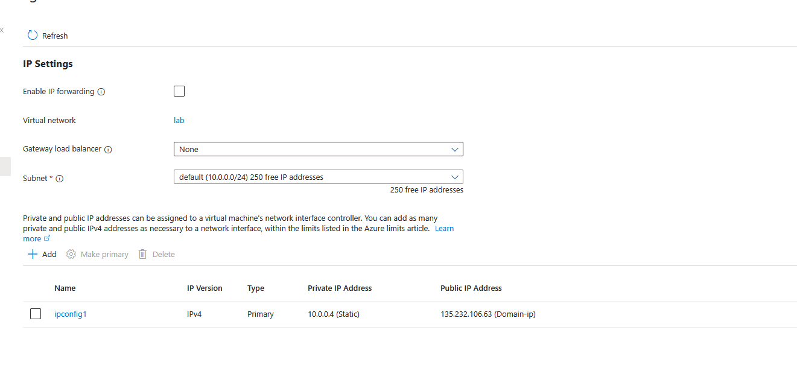
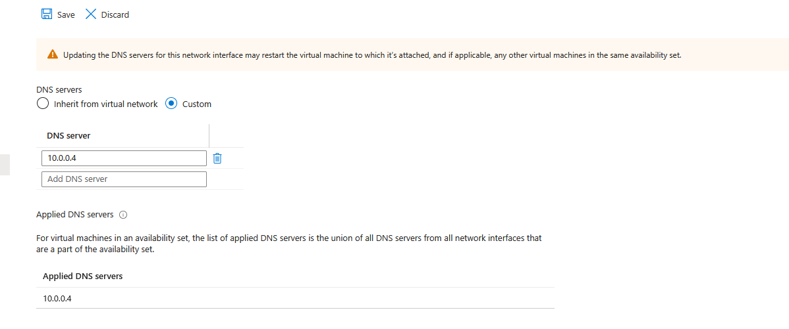

<h1>On-premises Active Directory Deployed in the Cloud (Azure)</h1>
This tutorial outlines the implementation of on-premises Active Directory within Azure Virtual Machines. 

<h2>Environments and Technologies Used</h2>

- Microsoft Azure (Virtual Machines/Compute)
- Remote Desktop
- Active Directory Domain Services
- PowerShell

<h2>Operating Systems Used </h2>

- Windows Server 2022
- Windows 10 (21H2)

<h2>High-Level Deployment and Configuration Steps</h2>

- Step 1 create domain controller and virtual machine onto the same subnet and set the domain conmtrollers private ip to static
- Step 2 set the vm to have the domain controllers private ip as its dns 
- Step 3 install active directory domain services and setup a new forest 
- Step 4 creat an OU for employees, admins, and clients

<h2>Actions and Observations</h2>

ip settings

 

dns server

 
